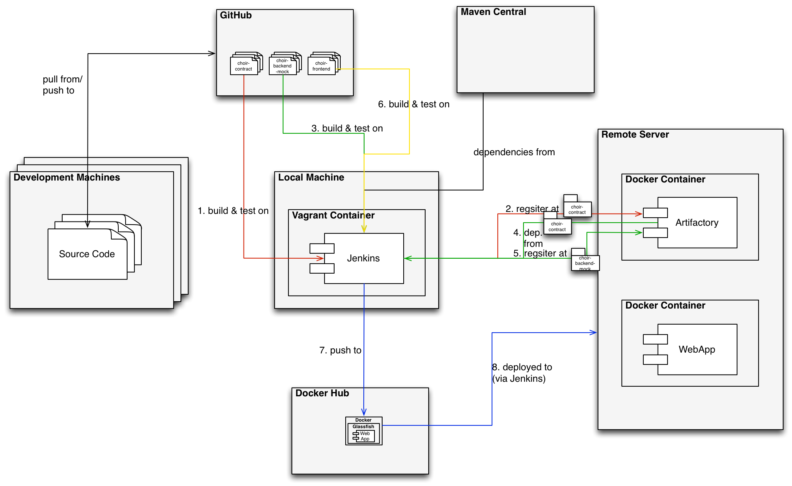

This document is related to the course Development of Large Systems at Copenhagen Business Academy (https://www.cphbusiness.dk/english/study-programmes/top-up-bachelors-degree/software-development/2nd-semester/). Some parts of it build on infrastructure code and experiences from Praqma's CoDe training (https://github.com/praqma-training/code-infra).

This is a guide on how to setup an example continuous integration (CI) chain using the following technologies and tools:

  * the distributed version control system (VCS) Git (https://git-scm.com) and GitHub (https://github.com) as host,
  * the build server Jenkins (https://jenkins.io),
  * Docker containers (https://www.docker.com) and DockerHub (https://hub.docker.com) as a public registry,
  * Vagrant (https://www.vagrantup.com) to setup and manage virtual machines
  * the Maven repository manager Artifactory (https://www.jfrog.com/open-source/),
  * the application server Glassfish (http://glassfish.java.net/),
  * and the cloud server provider Digital Ocean (https://www.digitalocean.com).


# Scenario

We have a Java project consisting of three projects, which depend on each other.

The project's source code can be found here:

  * Contracts: https://github.com/eguahlak/choir-contract
  * A mockup of a backend: https://github.com/eguahlak/choir-backend-mock
  * And a simple frontend: https://github.com/eguahlak/choir-frontend.git

In essence, these Java projects form a simple web-application, which serves a list of names via a JSP (http://<your_remote_host>:8080/Choir/ChoirManager).

The contracts project consists of a set of interfaces and data transfer objects (DTO) and is used to let different groups of students implement their frontends and backend systems independently against a common specification and mockups.

The purpose of this guide is not to detail this Java project. Instead, we just use it to illustrate some of the steps, which are required to setup a complete CI chain automatically deploying the project on a production server.

Importantly, the projects depend on each other. The backend mockup depends on the contracts and the frontend depends on the two other projects. The package dependencies -as specified in the Maven metadata (`pom.xml`) of the respective projects- are illustrated in the following.


The contracts project and the backend mockup are build as a JAR files, whereas the frontend project is build as a WAR file.


# The CI Setup

We have a set of distributed developers working on their local computers and collaborating on the same source code via a Git repository hosted on GitHub. Since, for this example we do not have access to a proper build server, i.e., a separate machine, we decide to setup an Ubuntu virtual machine (VirtualBox), which will host our Jenkins build server. In case you have access to a proper build server the explanations in the following apply as well except that you can skip reading the part on Vagrant and apply the provision script (`vm/provision.sh`) directly on your machine.

On a remote server -hosted at Digital Ocean, you can host it anywhere else according to your liking- we have, amongst others, a Docker container running an Artifactory instance, which serves our local Maven dependencies. Finally, to the same remote machine we will automatically deploy a Docker container, which hosts our web-application with the help of a Glassfish application server.

The setup is illustrated in the following.




Consequently, we have to setup a Jenkins build server in a Vagrant machine, we have to configure it, we have to setup a set of build jobs on it, we have to setup a remote machine with a dockerized Artifactory. The following sections provide a step-wise description on how to do so. To run through this example you should start by cloning this repository to your local machine (`git clone https://github.com/HelgeCPH/cph-code-infra.git`). Note, that `/path/to` in all of the following examples is the path to the directory in which you cloned this project. Furthermore, this guide assumes that you are in a Linux/Unix environment using BASH.


# Setup Your Remote Production Machine

For this example we rent the cheapest possible cloud machine at Digital Ocean -which they call "droplet". You can choose your own servers or any other providers. The descriptions and the provided setup script should be valid for any Debian-based Linux.

  * Create an account at Digital Ocean (https://www.digitalocean.com)
  * Create a new Ubuntu 16.04.1 droplet (smallest machine, 5$ per month)
  * Register your public SSH key while creating a droplet. If you do not have a pair of keys read on how to do that. (https://www.digitalocean.com/community/tutorials/how-to-use-ssh-keys-with-digitalocean-droplets)
  * SSH to your new machine and create a new user, which we will call `builder`. You can copy the IP `<your_ip>` from your droplet configuration page.
    ```bash
    ssh root@<your_ip>
    adduser builder
    usermod -aG sudo builder
    exit
    ```
  * Copy the setup script to the remote machine, log onto it, make the file executable, and run it.
    ```bash
    scp /path/to/remote/setup.sh builder@<your_ip>:/home/builder
    ssh builder@<your_ip>
    chmod u+x ./setup.sh
    ./setup.sh
    exit
    ```

Now you have a remote machine up and running with an Artifactory instance, an Apache webserver. To validate that these first steps were successful, navigate to http://<your_ip>/ where you should see documentation on how to connect to the Artifactory instance.


# Setup Your Local Build Machine

  * Install Vagrant (https://www.vagrantup.com/docs/installation/) and VirtualBox (https://www.virtualbox.org/wiki/Downloads) to your local machine
  * cd to the directory with the Vagrantfile and startup the VM. When started up for the first time `vagrant up` will automatically run the provision script (`provision.sh`). Note in case you want to allow your group members to log onto the Jenkins build server on this machine uncomment the line `  # config.vm.network "public_network"` in the `Vagrantfile`.
    ```bash
    cd /path/to/vm
    vagrant up
    ```
  * You can ssh into this VM via `vagrant ssh`
  * After starting the VM Jenkins should be up and running. You can access it via http://localhost:8080


## Configuring Jenkins

Now that Jenkins is running you have to configure it. On first time use it will present you the following page.


Here you have to insert the key that you get either from the output of the provision script or via:

```bash
vagrant ssh
sudo cat /var/lib/jenkins/secrets/initialAdminPassword
```

Subsequently, choose to *Install suggested plugins*. we will install the other required plugins later manually.

Afterwards, create a first admin user on Jenkins. For this example we will call it `builder` too.


Now, install some more plugins that we need to build our projects.

Navigate to  *Manage Jenkins* -> *Manage Plugins* -> *Available* and select the following plugins
  * `Maven Integration plugin`
  * `Artifactory Plugin`
  * `SSH plugin`

After selection, hit *Download now and install after restart* and on the next page check *Restart Jenkins when installation is complete and no jobs are running* and wait until Jenkins is restarted.

Configure how Jenkins finds your Maven installation. For this project we will download Maven dynamically:
*Manage Jenkins* -> *Global Tool Configuration*


  Manage Jenkins -> Global Tool Configuration -> Maven -> Install automatically
  setup your projects as maven projects


### Creating your Build Jobs


# Publish to a Docker Registry
If you do not want your repository to be public by default set the standard configuration in your settings (https://hub.docker.com/account/settings/) to private. You have one private repository for a free plan.


    docker tag e29c630fcc3d helgecph/glassfish-cph:13
    docker login -u <your_user_id> -p "<your_pwd>"
    docker push helgecph/glassfish-cph:13
    docker logout


# Deploy your image

    ssh builder@XXX

    docker stop `docker ps -a | grep helgecph/glassfish-cph | awk '{print substr ($0, 0, 12)}'`
    docker pull helgecph/glassfish-cph
    docker run -d -ti -p 4848:4848 -p 8080:8080 helgecph/glassfish-cph

    docker stop; docker pull helgecph/glassfish-cph; docker run -d -ti -p 4848:4848 -p 8080:8080 helgecph/glassfish-cph


## Allow Jenkins Remote Deployment Script Execution

    sudo su jenkins

    mkdir ~/.ssh/
    ssh-keyscan <YOURREMOTEHOST> > ~/.ssh/known_hosts
    exit
