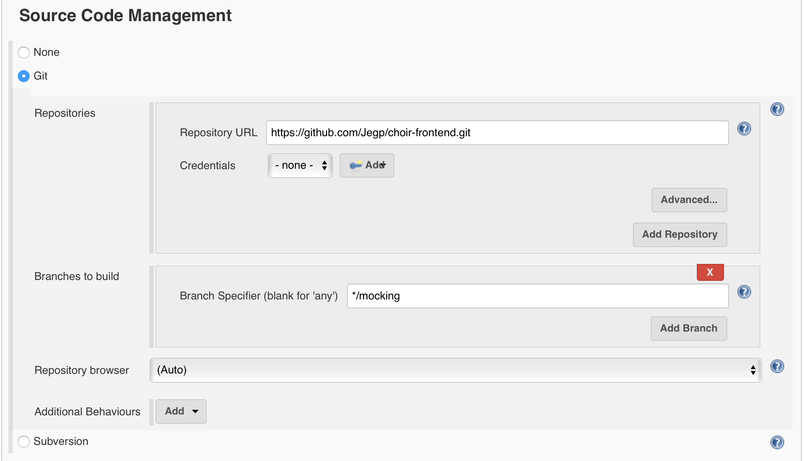
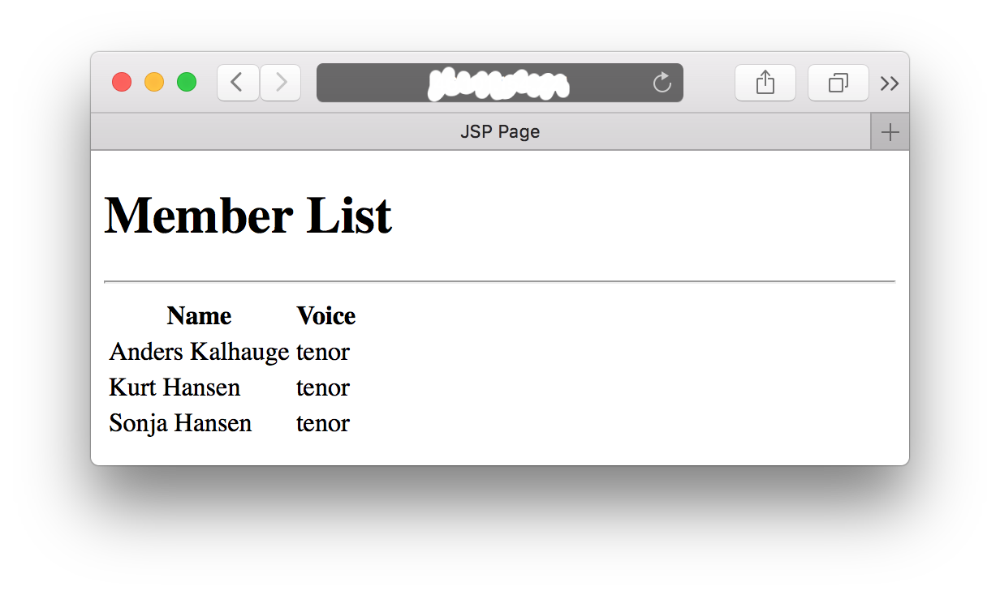

# A CI/CD Example Setup

This document is hosted at: https://github.com/HelgeCPH/cph-code-infra This PDF is just a dump of the original README.md.

It is related to the course Development of Large Systems at Copenhagen Business Academy (https://www.cphbusiness.dk/english/study-programmes/top-up-bachelors-degree/software-development/2nd-semester/). Some parts of it build on infrastructure code and experiences from Praqma's CoDe training (https://github.com/praqma-training/code-infra).

This is a guide on how to setup an example continuous integration (CI) chain using the following technologies and tools:

  * the distributed version control system (VCS) Git (https://git-scm.com) and GitHub (https://github.com) as host,
  * the build server Jenkins (https://jenkins.io),
  * Docker containers (https://www.docker.com) and DockerHub (https://hub.docker.com) as a public registry,
  * Vagrant (https://www.vagrantup.com) to setup and manage virtual machines
  * the Maven repository manager Artifactory (https://www.jfrog.com/open-source/),
  * the application server Glassfish (http://glassfish.java.net/),
  * and the cloud server provider Digital Ocean (https://www.digitalocean.com).


# Scenario

We have a Java project consisting of three projects, which depend on each other.

The project's source code can be found here:

  * Contracts: https://github.com/eguahlak/choir-contract
  * A mockup of a backend: https://github.com/eguahlak/choir-backend-mock
  * And a simple frontend: https://github.com/eguahlak/choir-frontend

In essence, these Java projects form a simple web-application, which serves a list of names via a JSP (http://<your_remote_host>:8080/Choir/ChoirManager).

The contracts project consists of a set of interfaces and data transfer objects (DTO) and is used to let different groups of students implement their frontends and backend systems independently against a common specification and mockups.

The purpose of this guide is not to detail this Java project. Instead, we just use it to illustrate some of the steps, which are required to setup a complete CI chain automatically deploying the project on a production server.

Importantly, the projects depend on each other. The backend mockup depends on the contracts and the frontend depends on the two other projects. The package dependencies -as specified in the Maven metadata (`pom.xml`) of the respective projects- are illustrated in the following.


The contracts project and the backend mockup are build as a JAR files, whereas the frontend project is build as a WAR file.

Remember to fork the backend mockup and the frontend example Java projects (https://github.com/eguahlak/choir-backend-mock, https://github.com/eguahlak/choir-frontend) so that you can modify the IP addresses in the `pom.xml`s to point to your machine running the Artifactory instance. Of course, this is only necessary when you want follow this tutorial and you want to replicate this example.


# The CI Setup

We have a set of distributed developers working on their local computers and collaborating on the same source code via a Git repository hosted on GitHub. Since, for this example we do not have access to a proper build server, i.e., a separate machine, we decide to setup an Ubuntu virtual machine (VirtualBox), which will host our Jenkins build server. In case you have access to a proper build server the explanations in the following apply as well except that you can skip reading the part on Vagrant and apply the provision script (`vm/provision.sh`) directly on your machine.

On a remote server -hosted at Digital Ocean, you can host it anywhere else according to your liking- we have, amongst others, a Docker container running an Artifactory instance, which serves our local Maven dependencies. Finally, to the same remote machine we will automatically deploy a Docker container, which hosts our web-application with the help of a Glassfish application server.

The setup is illustrated in the following.


Consequently, we have to setup a Jenkins build server in a Vagrant machine, we have to configure it, we have to setup a set of build jobs on it, we have to setup a remote machine with a dockerized Artifactory. The following sections provide a step-wise description on how to do so. To run through this example you should start by cloning this repository to your local machine (`git clone https://github.com/HelgeCPH/cph-code-infra.git`). Note, that `/path/to` in all of the following examples is the path to the directory in which you cloned this project. Furthermore, this guide assumes that you are in a Linux/Unix environment using BASH.


# Setup Your Remote Production Machine

For this example we rent the cheapest possible cloud machine at Digital Ocean -which they call "droplet". You can choose your own servers or any other providers. The descriptions and the provided setup script should be valid for any Debian-based Linux.

  * Create an account at Digital Ocean (https://www.digitalocean.com)
  * Create a new Ubuntu 16.04.3 x64 droplet (second smallest machine, 0.015USD per hour/ 10USD per month)
  * Register your public SSH key while creating a droplet. If you do not have a pair of keys read on how to do that. (https://www.digitalocean.com/community/tutorials/how-to-use-ssh-keys-with-digitalocean-droplets)
  * SSH to your new machine and create a new user, which we will call `builder`. You can copy the IP `<your_ip>` from your droplet configuration page.

    ```bash
    ssh root@<your_ip>
    adduser builder
    usermod -aG sudo builder
    exit
    ```
  * Enable public key authentication for your new user. The following assumes that you have a keypair readily available.

    ```bash
    ssh root@<your_ip>
    su - builder
    mkdir ~/.ssh
    chmod 700 ~/.ssh
    echo "<your_public_key>" > ~/.ssh/authorized_keys
    chmod 600 ~/.ssh/authorized_keys
    ```

    In case you have issues with this step make sure to read the guide on [initial Ubuntu server setup](https://www.digitalocean.com/community/tutorials/initial-server-setup-with-ubuntu-16-04), especially the section _"Step Four — Add Public Key Authentication"_!

  * Copy the setup script to the remote machine, log onto it, make the file executable, and run it.

    ```bash
    scp /path/to/remote/setup.sh builder@<your_ip>:/home/builder
    ssh builder@<your_ip>
    chmod u+x ./setup.sh
    ./setup.sh
    exit
    ```

Now you have a remote machine up and running with an Artifactory instance and an Apache webserver. To validate that these first steps were successful, point your browser to http://<your_ip>/ where you should see documentation on how to connect to the Artifactory instance.


# Setup Your Local Build Machine

  * Install Vagrant (https://www.vagrantup.com/docs/installation/) and VirtualBox (https://www.virtualbox.org/wiki/Downloads) to your local machine
  * `cd` to the directory with the `Vagrantfile` and startup the VM. When started up for the first time `vagrant up` will automatically run the provision script (`provision.sh`). Note in case you want to allow your group members to log onto the Jenkins build server on this machine uncomment the line `  # config.vm.network "public_network"` in the `Vagrantfile`.

    ```bash
    cd /path/to/vm
    vagrant up
    ```

  * You can ssh into this VM via `vagrant ssh`
  * After starting the VM Jenkins should be up and running. You can access it via http://localhost:9090


## Configuring Jenkins

Now that Jenkins is running you have to configure it. On first time use it will present you the following page.


Here you have to insert the key that you get either from the output of the provision script or via:

```bash
vagrant ssh
sudo cat /var/lib/jenkins/secrets/initialAdminPassword
```

Subsequently, choose to *Install suggested plugins*. we will install the other required plugins later manually.

Afterwards, create a first admin user on Jenkins. For this example we will call it `builder` too.


Now, install some more plugins that we need to build our projects.

Navigate to *Manage Jenkins* -> *Manage Plugins* -> *Available* and select the following plugins
  * `Maven Integration plugin`
  * `Artifactory Plugin`

After selection, hit *Download now and install after restart* and on the next page check *Restart Jenkins when installation is complete and no jobs are running* and wait until Jenkins is restarted.

Now, we configure how Jenkins finds your Maven installation. For this project we will download Maven dynamically:
Navigate to *Manage Jenkins* -> *Global Tool Configuration* and set the *Maven* section similar to the following and save.


Navigate to *Manage Jenkins* -> *Configure System*, set the *Artifactory* section to point to your Artifactory instance and test the connection to it. In case you did not modify the configuration of your Artifactory instance, then the standard login is `admin` and the standard password is `password`.


### Adding Credentials to Jenkins

To allow for the later use of DockerHub as registry for the container with the final web application you need to be registered at https://hub.docker.com.

After you have created a user at DockerHub, navigate to *Credentials* -> *(global)* -> *Add Credentials* (which corresponds to navigating to the following URL: http://localhost:8080/credentials/store/system/domain/_/ ).

There add a `Secret text`, where the secret is your password to your DockerHub account.


### Allow Jenkins User to Execute Deployment Script Remotely

To allow for a login from a non-interactive shell to the remote machine we have to create a pair of SSH keys for the `jenkins` user, i.e., the Linux user executing the shell scripts in Freestyle jobs.

You enable non-interactive login to the remote machine by logging to the VM, switching to the `jenkins` user, creating a pass-phrase-less key pair and moving them to the remote machine.

```bash
vagrant ssh
sudo su jenkins
ssh-keygen -t rsa -b 2048
cat /var/lib/jenkins/.ssh/id_rsa.pub
```

Copy the output of the cat command, i.e., the `jenkins` users' public key into you clipboard. From another terminal session connect to your remote server at DigitalOcean and register yet another public key.

```bash
ssh builder@46.101.154.221
echo "<your_public_jenkins_key>" >> ~/.ssh/authorized_keys
exit
```

To verify that the remote login based on the keys is working, `ssh` to the machine from the `jenkins` user in your Vagrant VM:

```bash
ssh builder@<your_ip>
```

Afterwards, to exit from the remote machine, from the `jenkins` user, and from the VM type:

```bash
exit
exit
exit
```

## Creating Your Build Jobs

In total we will create four build jobs. Three Maven build jobs and one *Freestyle* build job. The latter can incorporate anything and we will use it to execute shell commands to build and deploy our docker containers.

The build jobs are the following:

  * choir-contract (Maven project build job, red in image)
  * choir-backend-mock (Maven project build job, green in image)
  * choir-frontend (Maven project build job, yellow in image)
  * choir-build-docker (Freestyle project build job, blue in image)

The dependencies of the build jobs is given by their sequence above.


### A Maven Project Build Job for choir-contract

This job will, with the help of Maven, build the *choir-contract* code, create a JAR file from it and it will push the JAR file to Artifactory so that it can be resolved as dependency from other projects.

Navigate to *New Item*, select *Maven project*, and give it the name `choir-contract`. Subsequently, under *Source Code Management* choose `Git` and point it to corresponding repository on GitHub, see the following screenshot.


This build job -as configured so far- will build a JAR file on your build machine. You can try that by hitting *Build Now*, which schedules the build job. In the list of the build jobs on the left side you can select the one you just triggered and hit *Console Output* to verify that the build job just created a JAR file for you.

Now, we have to make this JAR file accessible to others by registering it to Artifactory. You do that by adding a *Add post-build action* -> *Deploy artifacts to Artifactory*, in which you point to your Artifactory server and the corresponding release and snapshot repositories, see the following screenshot.


Note, we did not setup any *Build Triggers* so far as for this example we schedule the build job manually. You can select *Build Triggers* to your project needs, such as *Build when a change is pushed to GitHub* or *Build periodically*.


### A Maven Project Build Job for choir-backend-mock

This job will, with the help of Maven, build the *choir-backend-mock* code, create a JAR file from it and it will push the JAR file to Artifactory so that it can be resolved as dependency from other projects.

Navigate to *New Item*, select *Maven project*, and give it the name `choir-backend-mock`. Subsequently, under *Source Code Management* choose `Git` and point it to corresponding repository on GitHub, see the following screenshot.


Now, we have to make this JAR file accessible to others by registering it to Artifactory. You do that by adding a *Add post-build action* -> *Deploy artifacts to Artifactory*, in which you point to your Artifactory server and the corresponding release and snapshot repositories, see the following screenshot.


Note, we did not setup any *Build Triggers* so far as for this example we schedule the build job manually. You can select *Build Triggers* to your project needs, such as *Build when a change is pushed to GitHub* or *Build periodically*, or *Build after other projects are built*, e.g., after `choir-contract` is built.

Furthermore, when building your own code similar to this you have to remember to modify your `pom.xml` accordingly. There you have to add another repository to resolve dependencies like this:

```xml
<repositories>
  <repository>
    <id>choir-repo</id>
    <name>Our Repo</name>
    <url>http://<your_ip>:8082/artifactory/libs-release-local</url>
  </repository>
</repositories>
```

### A Maven Project Build Job for choir-frontend

This job will, with the help of Maven, build the *choir-frontend* code, create a WAR file from it. This WAR file will be consumed by the subsequent freestyle build job.

Navigate to *New Item*, select *Maven project*, and give it the name `choir-frontend`. Subsequently, under *Source Code Management* choose `Git` and point it to corresponding repository on GitHub, see the following screenshot.



Note, when building your own code similar to this you have to remember to modify your `pom.xml` accordingly. There you have to add another repository to resolve dependencies like this:

```xml
<repositories>
  <repository>
    <id>choir-repo</id>
    <name>Our Repo</name>
    <url>http://<your_ip>:8082/artifactory/libs-release-local</url>
  </repository>
  <repository>
    <id>choir-repo-snapshot</id>
    <name>Our Snapshot Repo</name>
    <url>http://<your_ip>:8082/artifactory/libs-snapshot-local</url>
  </repository>
</repositories>
```


### A Freestyle Project Build Job for choir-build-docker

This job deploys the WAR file -which was generated by the previous build step- to a Docker container, which in turn is registered at the DockerHub. From there the container is deployed automatically to your remote production machine.

That is, the build job consists of two build steps. One for building the Docker container and distributing it to the DockerHub and a second one for deploying that container to the remote machine. Both build steps execute a sequence of shell commands.

Navigate to *New Item*, select *Freestyle project*, and give it the name `choir-build-docker`. Subsequently, under *Source Code Management* choose `Git` and point it to the repository on GitHub containing the `Dockerfile`, see the following screenshot.


Now, under *Build* -> *Add build step* choose `Execute shell`. Paste the following shell script into the *Command* field.

```bash
cp /var/lib/jenkins/workspace/choir-frontend/target/*.war ${WORKSPACE}
docker build -t <your_dockerhub_id>/glassfish-cph:${BUILD_NUMBER} .

set +x
docker login -u <your_dockerhub_id> -p "${DOCKERHUB_PWD}"
set -x

docker push <your_dockerhub_id>/glassfish-cph:${BUILD_NUMBER}
docker logout
```

The `set +x` suppresses echoing the operation to the console output. Your password should not appear there. With respect to Jenkins your password to the DockerHub is stored in the variable `${DOCKERHUB_PWD}`. To fill this variable accordingly you have to add a secret text to the configuration of the credentials plugin, see above. Furthermore, you have to configure the use of this as a *Secret text* under *Build Environment* as illustrated in the following screenshot.


Now, the newly build Docker image, which is registered to the DockerHub has to be deployed to the remote machine. For this, add another build step. Under *Build* -> *Add build step* choose `Execute shell` and paste the following shell script into the *Command* field.

```bash
ssh builder@<your_ip> "./deploy.sh ${BUILD_NUMBER} <your_dockerhub_id>"
```

Of course, remember in both scripts to replace `<your_dockerhub_id>` with your login name at DockerHub.

This will call the remote deployment script, which was put there during machine setup.

```bash
#!/bin/bash

BUILD_NUMBER=$1
DOCKER_ID=$2
# stop all running containers with our web application
docker stop `docker ps -a | grep ${DOCKER_ID}/glassfish-cph | awk '{print substr ($0, 0, 12)}'`
# remove all of those containers
docker rm `docker ps -a | grep ${DOCKER_ID}/glassfish-cph | awk '{print substr ($0, 0, 12)}'`
# get the newest version of the containerized web application and run it
docker pull ${DOCKER_ID}/glassfish-cph:${BUILD_NUMBER}
docker run -d -ti -p 4848:4848 -p 8080:8080 ${DOCKER_ID}/glassfish-cph:${BUILD_NUMBER}
```


# We are Done!

That is it! After creating and running the above four build jobs you should have the web application up and running on your remote machine. Try to navigate to http://<your_ip>:8080/Choir/ChoirManager and you should be served the following webpage.




# Improvements to the Example CI Chain

  * Add unit tests to the example projects.
  * Add transition from `SNAPSHOT` to `RELEASE` to build jobs.
  * Configure and share build jobs as Groovy scripts.
  * Share Jenkins configuration as Groovy scripts.
  * Build the Docker container using one of the corresponding Jenkins plugins.
  * Describe an alternative scenario, in which we use the *Deploy to* plugin to deploy directly to the Glassfish application server.
  * There is an issue with the Glassfish container killing the Artifactory container and vice-versa. I do not know the reason for that behavior yet.

The idea with the latter two would be to allow for a completely automatic and reproducible CI chain setup.
